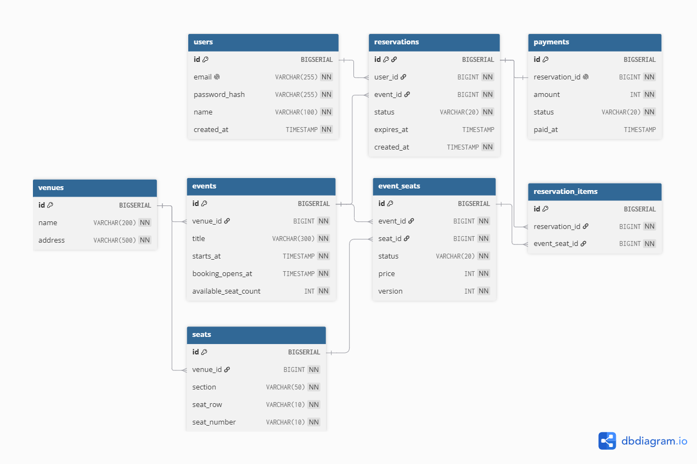

# TicketBook — 공연 티켓 예매 시스템

인기 공연 예매 오픈 시 같은 좌석에 수백 명이 동시 요청하는 상황을 **데이터베이스 수준에서 안전하게 처리**하는 웹 서비스.
DB 과목에서 배운 5개 핵심 개념을 실제 동작과 측정 데이터로 증명한다.

## 도메인 흐름

```
회원이 공연 선택 → 좌석맵에서 좌석 선택 → HOLD(임시 점유, 7분)
→ 결제 확정(CONFIRM) → 좌석 SOLD 확정 | 미결제 시 자동 만료(EXPIRE)
```

같은 좌석에 동시 요청이 오면 **정확히 1명만 성공**한다.

---

## ERD



**8개 테이블**, FK 관계로 참조 무결성 보장, CHECK 제약으로 상태값 제한.

---

## DB 5개 개념 — 구현과 증명

### 1. 데이터베이스 설계

8개 테이블, FK 관계, CHECK 제약(`status IN ('AVAILABLE','HELD','SOLD')`).
스키마는 Flyway 마이그레이션으로 버전 관리 (`V1__init.sql` ~ `V4__demo_users.sql`).

### 2. 정규화

| 설계 | 이유 |
|------|------|
| `seats`(물리좌석)와 `event_seats`(공연별 재고) 분리 | 같은 좌석이 공연마다 다른 가격/상태를 가짐. 분리하지 않으면 갱신 이상 발생. **3NF 만족.** |
| `reservation_items` 교차 테이블 | 1 예매 = N 좌석의 다대다 관계 해소 |
| `events.available_seat_count` 비정규화 | 매번 COUNT 쿼리를 피하기 위한 캐시 컬럼. **정규화 위반을 인지하고 읽기 성능을 위해 선택한 trade-off.** |

### 3. 인덱싱

3개 복합 인덱스 추가 후 EXPLAIN ANALYZE before/after 비교 (100,000건 기준):

| 쿼리 | Before | After | 개선 | 핵심 변화 |
|------|--------|-------|------|----------|
| AVAILABLE 좌석 조회 | 1.890ms | 0.286ms | **85%** | Filter 제거 → Index Cond |
| 만료 HOLD 스케줄러 | 33.880ms | 5.341ms | **84%** | Seq Scan → Index Scan |
| 내 예매 목록 | 61.904ms | 47.089ms | **24%** | reservations Seq Scan 제거 |
| HOLD FOR UPDATE | 0.668ms | 0.286ms | — | PK 충분 (negative control) |

추가한 인덱스: `event_seats(event_id, status)`, `reservations(status, expires_at)`, `reservations(user_id, created_at DESC)`.
HOLD FOR UPDATE는 PK로 이미 충분하여 추가 인덱스 불필요 — **"인덱스를 무작정 추가하지 않았다"는 근거.**

### 4. 트랜잭션

결제 확정(`confirmReservation`)이 하나의 `@Transactional` 안에서:
- `event_seats` HELD → SOLD
- `payment` 생성
- `reservation` PENDING → CONFIRMED

**중간에 예외 발생 시 전체 롤백 — 7개 테스트로 증명:**

| 테스트 | 검증 |
|--------|------|
| CONFIRM 실패(롤백) | seat.sell() 이후 예외 → 좌석 HELD 유지, payment 미생성, reservation PENDING 유지 |
| HOLD 실패(전체 실패) | 2석 중 1석 이미 HELD → 나머지 1석도 HOLD 안 됨 (부분 성공 없음) |
| 만료 HOLD 결제 불가 | expires_at 지난 reservation은 confirm 거부 |
| 소유권 검증 | 다른 사용자의 reservation은 cancel/confirm 불가 |

### 5. 동시성 컨트롤 (핵심)

같은 좌석에 10스레드 동시 요청 — 3가지 전략 비교:

| 전략 | 방식 | 성공 수 | oversell |
|------|------|---------|----------|
| **NAIVE** | version 조건 없는 UPDATE | ≥ 2 | **발생** |
| **PESSIMISTIC** | `SELECT ... FOR UPDATE` | 정확히 1 | 없음 |
| **OPTIMISTIC** | `@Version WHERE version = 0` | 정확히 1 | 없음 |

oversell 판정: 같은 `event_seat_id`에 active(`PENDING`/`CONFIRMED`) `reservation_item`이 2건 이상인지로 판단.

**CyclicBarrier로 critical interleaving을 결정적으로 재현하는 deterministic correctness test** 4개 통과.
운영 기본 전략: **PESSIMISTIC** — 좌석 예매는 경합이 강해 비관적 락이 가장 안전.

---

## 라이브 URL

| 구분 | URL |
|------|-----|
| Frontend | https://ticketing-wine-three.vercel.app |
| Backend API | https://ticketing-api-caty.onrender.com |

> Render 무료 티어 특성상 첫 접속 시 30~60초 지연될 수 있습니다.

**시연 계정:** `demo@ticketing.com` / `password123`

**시연 흐름:** 로그인 → 공연 목록 → 좌석맵(구역별 색상) → 좌석 선택 → HOLD → 결제 확정 → 내 예매 확인

---

## 기술 스택

| 구분 | 기술 |
|------|------|
| Backend | Java 17, Spring Boot 3.4, Spring Data JPA, Spring Security |
| Frontend | Next.js, TypeScript, Tailwind CSS |
| Database | PostgreSQL 16 (로컬 Docker / 배포 Neon) |
| Migration | Flyway |
| SQL 로깅 | p6spy |
| 테스트 | JUnit 5, Testcontainers (11개 — 트랜잭션 7 + 동시성 4) |
| 배포 | Neon (DB) + Render (API) + Vercel (Frontend) |

## 로컬 실행

```bash
# Backend
cd backend && docker compose up -d && source .env && ./gradlew bootRun

# Frontend (새 터미널)
cd frontend && npm install && npm run dev

# 테스트
cd backend && ./gradlew test
```

## 프로젝트 구조

```
ticketing/
├── backend/                    # Spring Boot API
│   ├── src/main/resources/db/migration/
│   │   ├── V1__init.sql        # 스키마 (8개 테이블)
│   │   ├── V2__seed_data.sql   # 시드 데이터
│   │   ├── V3__add_indexes.sql # 인덱스 3개
│   │   └── V4__demo_users.sql  # 시연 사용자
│   └── src/main/java/com/ticketing/
│       ├── booking/            # 예매 (서비스, 컨트롤러, 엔티티)
│       ├── event/              # 공연/좌석
│       └── config/             # Security, JWT, CORS
├── frontend/                   # Next.js 프론트엔드
├── load-test/                  # k6 부하 테스트 스크립트
├── scripts/                    # 측정용 대량 seed (100,000건)
└── docs/
    ├── evidence/               # Phase 3~5 증거물 (EXPLAIN 원문 등)
    └── *.md                    # SPEC, PLAN, DATA_MODEL, API, CONCEPTS, DECISIONS
```

## 상세 문서

- [프로젝트 명세](docs/SPEC.md) · [데이터 모델 / ERD](docs/DATA_MODEL.md) · [API 명세](docs/API.md)
- [설계 결정 로그](docs/DECISIONS.md) · [5개 개념 매핑](docs/CONCEPTS.md) · [개발 계획](docs/PLAN.md)
- [배포 가이드](docs/DEPLOYMENT.md)
